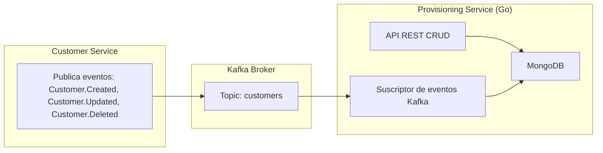

# TelecomX - Provisioning Service

Este microservicio forma parte del ecosistema **TelecomX**, una arquitectura orientada a eventos basada en el patrón **Broker Messaging**.  
Su función principal es manejar la provisión de usuarios a partir de los eventos generados en el sistema central de clientes.

---

## 🧩 Descripción General

El **Provisioning Service** escucha los eventos publicados en el tópico `customers` de **Kafka** y realiza operaciones sobre una base de datos **MongoDB**.  
Además, expone un conjunto de endpoints REST para consultar y administrar la información de los usuarios provisionados.

---

## ⚙️ Arquitectura



## API

````http request
### Crear una portabilidad
POST  http://localhost:8080/provisioning HTTP/1.1
content-type: application/json
{
	"userId": "123456789",
	"serviceName": "Portability",
	"status": "Requested",
}

### Consultar portabilidades
GET http://localhost:8080/provisioning HTTP/1.1
###
````